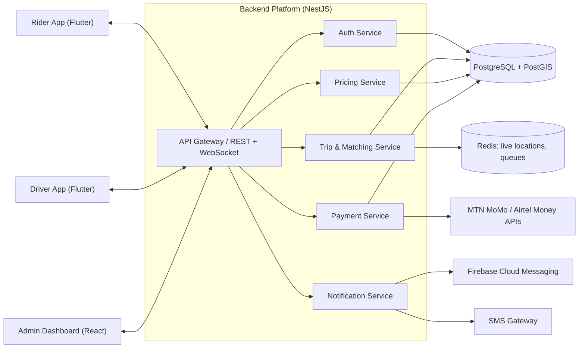
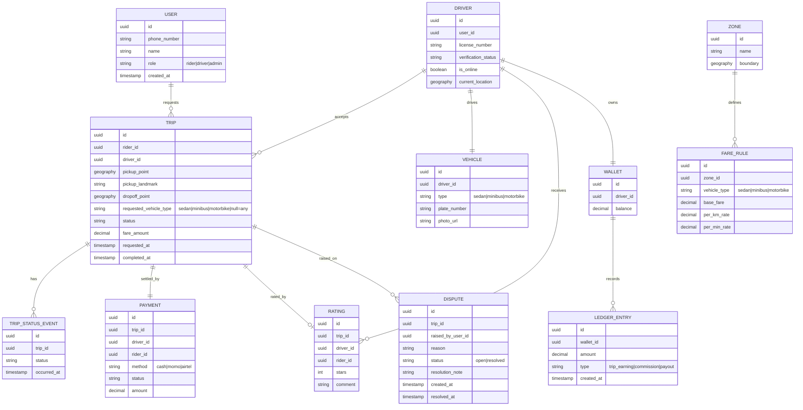
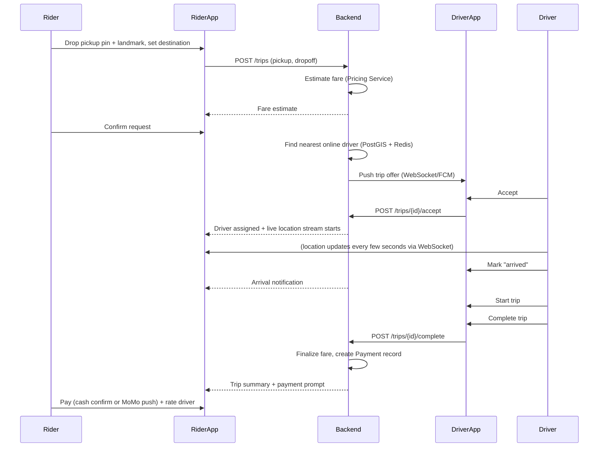

# Monze Ride-Hailing Platform — Architecture & Design Spec

*A Yango-style on-demand transport app, scoped and designed for Monze, Zambia.*

## 1. Overview & Product Framing

"An app like Yango" usually conjures Yango's full continental platform — rides,
deliveries, groceries, dynamic surge pricing, thousands of drivers. That is
the wrong target for Monze. Monze is a small town (roughly 50,000 people in
the urban area), served today by minibuses, a modest pool of private-hire
taxi drivers, and a fast-growing number of motorbike taxis (boda-bodas) who
mostly get hailed by phone call or roadside flag-down.

The right product is a **focused on-demand ride app**: a rider taps "request
a ride," the nearest available driver — car, minibus, **or motorbike**
— accepts, both sides track the trip live, and payment happens by cash or
mobile money. It should feel like Yango's core ride flow, stripped of
everything that only makes sense at national/continental scale.

Motorbikes deserve explicit product support, not a bolt-on: they are cheaper
per trip, faster through town congestion and market-day crowds, and able to
reach unpaved or narrow roads a car can't — which fits Monze's road network
better than a car-only model. Modeling them as a first-class vehicle type
from day one (see the data model in §5) also gives the platform a natural
lower-cost tier for price-sensitive riders and an easy entry point for
motorbike owners who couldn't otherwise afford to join as drivers.

Design constraints that shape every decision below:

| Constraint | Implication |
|---|---|
| Small, high-end-light driver pool (tens, not thousands) | Simple nearest-driver matching beats ML-based dispatch |
| Low-end Android devices dominate | Small APK size, low RAM/CPU footprint, aggressive caching |
| Patchy, metered mobile data | Minimize payload size, support graceful offline/SMS fallback |
| No formal street addressing in much of the town | Pickup by map-pin + landmark description, not address autocomplete |
| Cash-heavy economy, mobile money (MTN MoMo / Airtel Money) as digital rail | No assumption of card payments; mobile money and cash are first-class |
| Small dev budget / small team | Prefer one cross-platform mobile codebase, managed/cheap infra, avoid bespoke ML |

## 2. System Actors & Apps

- **Rider app** (Android-first mobile app) — request rides, track driver, pay, rate.
- **Driver app** (Android-first mobile app) — go online/offline, accept trip requests, navigate, collect payment, view earnings.
- **Admin/Dispatch web dashboard** — operations team: approve driver onboarding, monitor live trips, configure fares/zones, handle disputes and refunds, view analytics.
- **Backend platform** — shared API, matching engine, and data store behind all three.

## 3. Recommended Tech Stack

| Layer | Choice | Why |
|---|---|---|
| Rider + Driver apps | **Flutter** | One Dart codebase covers both apps and (with the same widgets) could later target iOS; compiles to small, fast native binaries that run well on low-end Android; strong offline-first tooling (local SQLite/Hive caching, connectivity-aware UI). Beats React Native on raw performance/footprint for this device profile, and beats native Kotlin on dev cost since one team maintains both apps. |
| Backend API | **Node.js + NestJS (TypeScript)** | Structured, testable service layout out of the box; huge ecosystem for payment/SMS integrations; easy to hire for regionally. |
| Primary database | **PostgreSQL + PostGIS** ✅ PostGIS scaffolded, for zone-boundary matching (`backend/src/zones/`, see §6.3) rather than driver search — driver-to-pickup distance is Redis+haversine, see §7 | PostGIS gives efficient point-in-polygon zone matching and, if ever needed, "find nearest driver within radius" geospatial queries without a bespoke matching service. |
| Live location / matching cache | **Redis** ✅ scaffolded (`backend/src/realtime/location.service.ts` — 60s-TTL cache of each online driver's position) | Sub-second read/write for "where are all online drivers right now," trip-state pub/sub, and the request-matching queue. |
| Real-time transport | **WebSocket (Socket.IO)** ✅ scaffolded (`backend/src/realtime/location.gateway.ts`), with SMS fallback for trip-status changes (not yet built — see the OTP delivery row below for the SMS gateway itself, which *is* wired up) | Push live driver location and trip status to both apps; when a device drops off data, fall back to SMS for critical state changes (trip accepted, driver arrived, trip completed). |
| OTP delivery (login) | **SMS via Africa's Talking** ✅ scaffolded (`backend/src/auth/sms.service.ts` — reaches MTN/Airtel/Zamtel through one API; falls back to logging the code instead of sending when no credentials are configured, so dev/CI need no real gateway) | Phone-based login needs the OTP to actually reach the rider/driver's handset, not just a JWT-issuing endpoint. |
| Admin dashboard | **React + TypeScript + Tailwind** ✅ scaffolded (`admin/`; plain Tailwind rather than shadcn, to keep the dependency footprint small for a scaffold) | Fast to build CRUD-heavy ops screens; same API as the mobile apps. |
| Payments | **MTN Mobile Money & Airtel Money APIs** (primary) ✅ scaffolded (`backend/src/payments/`, dev-mode simulated — no live provider credentials yet), cash (equally first-class, tracked in-app), card (future/optional via a gateway like Flutterwave/DPO if ever needed) | Matches how money actually moves in Monze today. |
| Maps | **Landmark-first pickup UX** on top of a map SDK — start with **Google Maps SDK** for reliability/familiarity, keep an **OpenStreetMap + self-hosted tiles** path open as a lower-cost fallback if API costs become a concern at scale | Formal addressing is sparse; the UI should let riders drop a pin and add a landmark note ("blue gate near Monze market") rather than rely on address search. |
| Push notifications | **Firebase Cloud Messaging** | Free, reliable, works well alongside Flutter. |
| Infra | **Docker containers**, deployed to a nearby low-cost cloud region (e.g. South Africa or EU — no in-country hyperscaler presence today); managed Postgres/Redis to start | Keeps ops overhead low for a small team; can move to self-managed infra later if costs demand it. |

## 4. High-Level System Architecture



## 5. Core Domain Model



## 6. Key Flows

### 6.1 Ride request → matching → completion



### 6.2 Driver onboarding

1. Driver registers in the Driver app with phone number (OTP verification).
2. Submits license, national ID, vehicle photo, plate number.
3. Admin dashboard queues the application for manual review.
4. Ops staff verifies documents, approves or rejects.
5. On approval, driver account flips to `verification_status = approved` and can go online.

### 6.3 Fare estimation

✅ scaffolded (`POST /trips/fare-estimate`, `backend/src/trips/trips.service.ts`'s
`estimateFare` — matches the pickup point to a zone via PostGIS
`ST_Contains`, applies that zone + vehicle type's fare rule; see
`backend/README.md`'s "Zone-based fare pricing"). Duration has no real
routing/traffic API behind it yet — a flat assumed town-driving speed
applied to the haversine distance, a ballpark rather than a routed ETA.

Kept deliberately simple and transparent rather than Yango-style dynamic
surge, since Monze's market doesn't have the volume to make surge
meaningful — and transparent pricing builds trust in a new market:

```
fare = fare_rule(zone, vehicle_type).base_fare
     + (distance_km * fare_rule(zone, vehicle_type).per_km_rate)
     + (est_duration_min * fare_rule(zone, vehicle_type).per_min_rate)
```

Zones let the admin team set different base rates for, e.g., town-center
trips vs. trips to outlying areas, without needing a dynamic pricing engine.
Fare rules are keyed by **zone + vehicle type**, so motorbike trips can be
priced noticeably below car trips (reflecting real running costs and giving
riders an affordable option) without any special-casing in the pricing
logic itself.

### 6.4 Offline / low-connectivity degradation

- Map tiles for the town center are pre-cached on first app launch so pickup
  pin-dropping works even with a weak signal.
- If a WebSocket connection drops mid-trip, both apps fall back to polling
  every 15–30s; if data drops entirely, critical status changes (driver
  assigned, arrived, completed) are also sent via SMS.
- Trip requests made while briefly offline are queued locally and submitted
  the moment connectivity returns, rather than failing outright.

## 7. Driver Matching & Dispatch

Given a driver pool in the tens-to-low-hundreds, a simple radius search is
sufficient — no need for the ML-based dispatch optimization larger
platforms use:

1. ✅ scaffolded — `GET /trips/available` (`backend/src/trips/trips.service.ts`,
   `backend/src/trips/trips.controller.ts`) sorts open trip requests by
   haversine distance from the requesting driver's last-known position,
   cached in Redis by an idle `driver:location` WebSocket ping
   (`backend/src/realtime/location.gateway.ts`) the driver app sends as soon
   as it goes online. This is distance-sorting of the *driver's own pull*
   of open requests, not the expanding-radius *push* dispatch below —
   see `backend/README.md`'s "Driver matching" section for details.
2. ✅ scaffolded — Rank candidates by distance (driver rating is not yet a
   ranking factor, just distance — see `backend/README.md`'s "Active driver
   dispatch" section).
3. ✅ scaffolded — `DispatchService`
   (`backend/src/realtime/dispatch.service.ts`) offers the trip to the top
   candidate over the socket (`trip:offer`) with a 15s accept window; if
   the window passes with no accept, it cascades to the next-nearest
   online driver, and so on through the whole online driver pool.
4. Still not built — no explicit "notify the rider, suggest retrying" step
   once the entire online driver pool has been offered a trip and none
   accepted. The trip simply stays `requested` and visible via the
   pull-based `GET /trips/available` (step 1) — a rider isn't told the
   push cascade specifically ran out, just sees their trip still pending.

**Growth path:** if the driver pool grows into the hundreds and multiple
towns are added, this can evolve into a proper matching service that scores
drivers on ETA, acceptance rate, and rider preference — but that's
over-engineering for launch.

## 8. Non-Functional Requirements

- **Performance:** trip request → driver offer should round-trip in under
  ~3s on a 3G connection; this is comfortably achievable at Monze's scale.
- **Offline resilience:** see §6.4; the app should never be fully unusable
  due to a dropped connection.
- **Security:** OTP-based phone auth, JWT session tokens, encrypted at-rest
  storage for ID documents, PCI-conscious handling of any card data if that
  path is ever added (avoid storing raw card numbers — use the payment
  gateway's tokenization).
- **Privacy:** driver ID documents and location history are sensitive;
  handle in line with Zambia's Data Protection Act (2021) — data
  minimization, defined retention periods, and driver consent for location
  tracking while online.
- **Scalability path:** the stack (NestJS + Postgres/PostGIS + Redis) scales
  horizontally well past what Monze alone would need, and expansion to
  nearby towns (Mazabuka, Choma) is now genuinely a config/data change —
  `POST /towns` plus each town's zones/fare-rules — not a re-architecture,
  per §9 Phase 4's multi-town support.
- **Observability:** structured logging, request tracing, and dashboards for
  trip funnel metrics (requested → matched → completed → paid) from day one,
  since a small ops team needs visibility without deep debugging.

## 9. MVP Roadmap

| Phase | Scope |
|---|---|
| **Phase 1 — Core loop** ✅ scaffolded | Rider requests a trip (car, minibus, or motorbike), driver accepts, manual/cash fare, basic trip status tracking. No live GPS yet — just status updates. Code scaffold: [`backend/`](../backend) (NestJS API), [`mobile/rider_app/`](../mobile/rider_app), [`mobile/driver_app/`](../mobile/driver_app). |
| **Phase 2 — Live tracking, digital payment & ratings** ✅ scaffolded | MTN MoMo / Airtel Money integration ✅ scaffolded ([`backend/src/payments/`](../backend/src/payments) — collections from riders, disbursements/payouts to drivers, dev-mode simulation since no real provider credentials exist yet). Real-time GPS tracking ✅ scaffolded ([`backend/src/realtime/`](../backend/src/realtime) — WebSocket gateway backed by Redis, verified against a real Postgres+Redis+socket client, not just built). Post-trip ratings ✅ scaffolded ([`backend/src/ratings/`](../backend/src/ratings) — one rating per completed trip, rider-only, driver's aggregate exposed via `GET /drivers/me/rating`; verified end-to-end against a real Postgres, including the duplicate/ownership/pre-completion rejections and the running-average math). |
| **Phase 3 — Ops tooling** ✅ scaffolded | Admin dashboard ✅ scaffolded ([`admin/`](../admin), React+TypeScript+Tailwind — driver onboarding & approval, live trip monitoring, zone/fare-rule configuration, dispute handling; verified with a Playwright script driving the actual UI against a real running backend, not just built). Ships with a security fix: self-service signup could previously mint an admin account by passing `role: "admin"`; the backend now refuses that, and admin accounts only come from an out-of-band seed script (`backend/src/scripts/create-admin.ts`). |
| **Phase 4 — Scale-out** | Zone-based fare pricing ✅ scaffolded ([`backend/src/zones/`](../backend/src/zones), [`backend/src/trips/trips.service.ts`](../backend/src/trips/trips.service.ts)'s `estimateFare` — zones can now carry a real PostGIS boundary polygon, matched against a trip's pickup point to auto-compute a fare estimate from the zone + vehicle type's rate card, per §6.3's formula; verified against a real Postgres with PostGIS; see `backend/README.md`'s "Zone-based fare pricing" for the full verification and what's still deliberately out of scope, like an admin-UI map for drawing boundaries). Driver payout automation ✅ scaffolded ([`backend/src/payments/payout-scheduler.service.ts`](../backend/src/payments/payout-scheduler.service.ts), `PaymentsService.runAutoPayouts` — an opt-in scheduled sweep that pays a driver's full wallet balance out automatically once it clears a minimum, instead of them having to remember to request one; off by default, an admin can also trigger it on demand; verified against a real Postgres + Redis, see `backend/README.md`'s "Driver payout automation"). Multi-town support ✅ scaffolded ([`backend/src/towns/`](../backend/src/towns), a new PostGIS-boundary entity one level up from Zone — see `backend/README.md`'s "Multi-town support" — scopes `GET /trips/available` so a driver in one town never sees another town's requests; verified against a real Postgres + Redis with two non-overlapping towns). Referral program ✅ scaffolded ([`backend/src/referrals/`](../backend/src/referrals) — every signup gets a code; entering someone else's at signup and then completing a first trip credits the referrer a flat reward, tracked in its own small ledger deliberately kept separate from the driver-only Wallet system; verified against a real Postgres + Redis, see `backend/README.md`'s "Referral program" for the full verification and what's deliberately not wired up yet, namely spending the credit against a future fare). Surge pricing deliberately still not built — §6.3 explicitly argued against it at launch; see `backend/README.md`'s "Surge pricing" for the reasoning and the hook a future revisit would use. |

## 10. Open Questions for Stakeholders

- **Driver supply model:** independent owner-operators applying individually, or onboarding via existing minibus/taxi associations in bulk?
- **Regulatory:** what licensing or permit requirements does the Monze Municipal Council (or national transport regulator) impose on app-based dispatch — is a permit or registration needed before launch?
- **Vehicle types:** motorbikes, cars, and minibuses are now all modeled as point-to-point trips with the same status flow (see §5, §9) — is that right, or do shared/fixed-route minibus trips need a materially different booking flow (e.g. multiple riders per trip)?
- **Motorbike safety:** should the app require proof of a helmet policy or basic rider-safety training before approving a motorbike driver, given the higher injury risk of that vehicle type?
- **Commission model:** implemented as a per-vehicle-type percentage (15% car / 12% minibus / 10% motorbike — see [`backend/src/config/commission.config.ts`](../backend/src/config/commission.config.ts)). For cash trips it's deducted into a driver `Wallet` as a debt (driver already holds the fare; blocked from going online past K100 owed, settled via `POST /drivers/:driverId/wallet/settlements`). For mobile money trips the platform collects the fare directly and credits the driver's net share to their wallet, payable out via `POST /payments/payout` — see §3 and `backend/src/payments/`. Open for stakeholders to confirm: are these the right rates, is K100 the right block-online threshold, and — now that mobile money settlement exists — should cash commission debts eventually be settleable the same way instead of admin-recorded cash?
- **Emergency/safety features:** is an SOS button, trip-sharing with a contact, or driver background-check requirement needed for launch, or can it wait for Phase 2/3?
